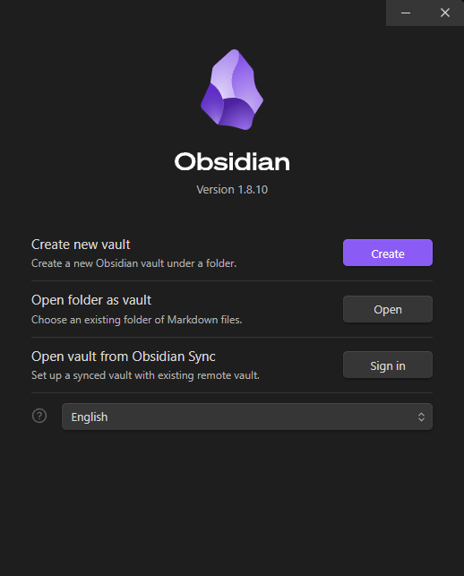

# Como importar as notas para o Obsidian
Primeiro é necessário ter o [Obsidian](https://obsidian.md/)

Clone o repositório

```bash
git clone https://github.com/artmarmocathala/Obsidian-Notes.git
```

Clique em "Open" ao lado de "Open folder as vault" e selecione a pasta UNB-Notes

